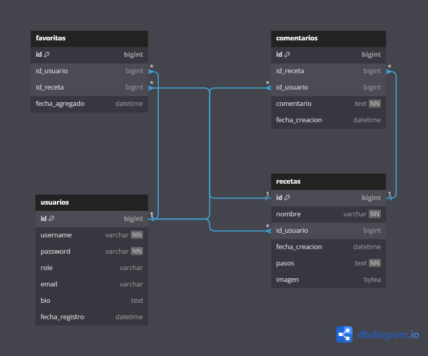

# API REST KOTLIN

## Nombre del Proyecto
**Recetillo**

## Idea del Proyecto

El proyecto consiste en una **API REST** que gestiona una pequeña red social donde los usuarios pueden compartir sus recetas de cocina, ver las de otros, comentarlas, y marcarlas como favoritas.

Esta API estará diseñada para que se conecte una aplicación de **Android**.

## Justificación del Proyecto

El sector de las redes sociales está saturado, pero no existe ninguna aplicación específica para recetas de cocina que controle el sector. Para establecer Recetillo y atraer usuarios debemos cubrir los siguientes campos:

- Publicar sus propias recetas con facilidad.
- Interactuar con otros usuarios mediante comentarios y favoritos.
- Descubrir nuevas recetas, adaptadas a tus gustos o restricciones dietéticas.
- Conectar con personas con intereses culinarios similares.

En resumen, este proyecto ofrece una forma sencilla y divertida de compartir el gusto por la cocina y encontrar a personas tan interesadas en ello como tú.

## Descripción Detallada de las Tablas

### 1. **usuarios**
Esta tabla almacena la información de los usuarios registrados en la aplicación.

- `id` (bigint): Identificador único del usuario (clave primaria, autoincrementable).
- `username` (varchar): Nombre de usuario único.
- `password` (varchar): Contraseña del usuario para autenticación se guardará encriptada.
- `role` (varchar): Rol del usuario (puede ser "user" o "admin").
- `email` (varchar): Correo electrónico del usuario.
- `bio` (text): Breve biografía del usuario (campo opcional).
- `fecha_registro` (datetime): Fecha de registro del usuario.

### 2. **recetas**
Almacena la información de las recetas compartidas por los usuarios.

- `id` (bigint): Identificador único de la receta.
- `nombre` (varchar): Nombre de la receta.
- `id_usuario` (bigint): Identificador del usuario que publicó la receta (relación con la tabla `usuarios`).
- `fecha_creacion` (datetime): Fecha de creación de la receta.
- `pasos` (text): Descripción detallada de los pasos para preparar la receta.
- `imagen` (bytea): Imagen de la receta (se guardara como un array de bytes).

### 3. **favoritos**
Tabla que almacena las recetas marcadas como favoritas por los usuarios.

- `id` (bigint): Identificador único del favorito.
- `id_usuario` (bigint): Identificador del usuario que ha marcado la receta como favorita (relación con la tabla `usuarios`).
- `id_receta` (bigint): Identificador de la receta marcada como favorita (relación con la tabla `recetas`).
- `fecha_agregado` (datetime): Fecha en la que la receta fue agregada a favoritos.

### 4. **comentarios**
Esta tabla almacena los comentarios hechos por los usuarios sobre las recetas.

- `id` (bigint): Identificador único del comentario.
- `id_receta` (bigint): Identificador de la receta comentada (relación con la tabla `recetas`).
- `id_usuario` (bigint): Identificador del usuario que hizo el comentario (relación con la tabla `usuarios`).
- `comentario` (text): El texto del comentario realizado por el usuario.
- `fecha_creacion` (datetime): Fecha de creación del comentario.

---

## Funcionalidades Clave de la API

### Endpoints de Usuario
- **POST /users/register**: Registra un nuevo usuario en la plataforma.
    - Respuesta: Código 201 (Created) o 400 (Bad Request).
- **POST /users/login**: Inicia sesión con un usuario existente.
    - Respuesta: Código 201 (Created) o 400 (Bad Request).
- **GET /users/{id}**: Obtiene información del usuario por ID.
    - Respuesta: Código 200 (OK) o 404 (Not Found).

### Endpoints de Recetas
- **POST /recipes**: Permite a un usuario crear una nueva receta.
    - Respuesta: Código 201 (Created) o 400 (Bad Request).
- **GET /recipes**: Obtiene una lista de todas las recetas.
    - Respuesta: Código 200 (OK) o 404 (Not Found).
- **GET /recipes/{id}**: Obtiene los detalles de una receta específica.
    - Respuesta: Código 200 (OK) o 404 (Not Found).

### Endpoints de Favoritos
- **POST /favorites**: Marca una receta como favorita.
    - Respuesta: Código 201 (Created) o 400 (Bad Request).
- **GET /favorites/{id}**: Obtiene todas las recetas favoritas de un usuario.
    - Respuesta: Código 200 (OK) o 404 (Not Found).

### Endpoints de Comentarios
- **POST /comments**: Permite a un usuario comentar en una receta
    - Respuesta: Código 201 (Created) o 400 (Bad Request).
- **GET /comments/{recipe_id}**: Obtiene todos los comentarios de una receta.
    - Respuesta: Código 200 (OK) o 404 (Not Found).

## Excepciones y códigos de estado
- **400 (Bad Request)**:  Datos inválidos (Ej: fecha anterior, correo duplicado).
- **404 (Not Found)**: Entidad no encontrada (Ej: usuario o receta inexistente).
- **201 (Created)**: Creación exitosa de una entidad.
- **200 (OK)**: Operación exitosa.

---

## Diagrama Entidad-Relación

